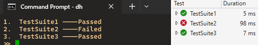

# A command line hub for common dotnet actions and shortcuts
Launch the shell using the .bat script which allows 
- Automatically identifies and lists all test projects from current dir
- Run single letter command to execute common dotnet commands such at test, run all tests and silent build 

Provides an overview much like visual studio gui for running and checking status of test suites

